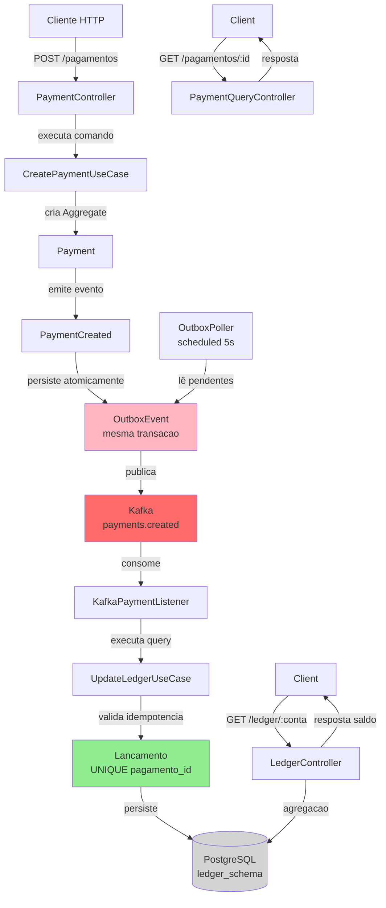

# CQRS + Transactional Outbox + CDC

Implementação completa dos padrões **CQRS**, **Transactional Outbox** e **CDC** com dois microsserviços em Java 21 e Spring Boot 4, garantindo consistência eventual entre serviços sem Two-Phase Commit.

> 🎯 **Propósito:** Demonstrar como construir microsserviços resilientes com eventos confiáveis — padrão usado por Nubank, Itaú, iFood, Bradesco em produção.

---

## 🏗️ Arquitetura



---

## 📋 Visão Geral

### O Problema

Em arquiteturas distribuídas com microsserviços, quando você precisa gravar no banco **E** publicar um evento no Kafka, duas operações em transações separadas criam inconsistência:

- ❌ Banco atualiza, Kafka falha → evento perdido
- ❌ Kafka publica, banco falha → estado inconsistente

### A Solução: Transactional Outbox

```java
@Transactional
public void criarPagamento() {
    Payment p = new Payment(...);
    paymentRepository.save(p);           // tabela payments
    outboxRepository.save(new OutboxEvent(p));  // tabela outbox (MESMA TRANSAÇÃO)
}
```

Uma transação atômica grava tanto `Payment` quanto o evento na tabela `outbox_events`. Se falhar, ambos rollbackeiam.

Depois, um **OutboxPoller agendado** processa a fila de eventos e publica no Kafka. Se Kafka falhar, retry automático.

### Padrões Implementados

| Padrão | O que faz | Onde usa |
|--------|-----------|----------|
| **CQRS** | Separa escrita (payment-service) de leitura (ledger-service) | 2 microsserviços, 2 bancos de dados |
| **Outbox** | Grava evento + estado na mesma transação | PaymentUseCase → OutboxEvent |
| **CDC** | Poller lê `outbox_events`, publica Kafka, marca processado | OutboxPoller (a cada 5s) |
| **Idempotência** | Query side verifica se já processou antes de gravar | ledger-service + constraint UNIQUE |

---

## 🛠️ Stack Tecnológico

| Camada | Tecnologia |
|--------|-----------|
| **Runtime** | Java 21 |
| **Framework** | Spring Boot 4.0.8 |
| **Build** | Maven (multi-módulo) |
| **Dados** | PostgreSQL 16 (2 schemas: payment + ledger) |
| **Migrations** | Flyway |
| **Mensageria** | Apache Kafka 7.6.0 |
| **Padrões** | CQRS, Outbox, CDC, Idempotência |
| **Testes** | JUnit 5, Mockito, Testcontainers |
| **Documentação** | Springdoc OpenAPI (Swagger) |

---

## 🚀 Como Rodar

### Pré-requisitos

- Java 21
- Maven 3.9+
- Docker e Docker Compose
- Git

### 1. Clone o repositório

```bash
git clone https://github.com/nevvesdev/cqrs-pattern.git
cd cqrs-pattern
```

### 2. Suba a infraestrutura

```bash
docker-compose up -d
```

Isso sobe:
- **PostgreSQL 16** em `localhost:5432` (2 schemas)
- **Zookeeper** em `localhost:2181`
- **Kafka** em `localhost:9092`

### 3. Rode os dois microsserviços

**Terminal 1 — Payment Service (Command Side):**

```bash
cd payment-service
./mvnw spring-boot:run
# Sobe em http://localhost:8080
```

**Terminal 2 — Ledger Service (Query Side):**

```bash
cd ledger-service
./mvnw spring-boot:run
# Sobe em http://localhost:8081
```

### 4. Acesse as APIs

- **Payment API Docs:** `http://localhost:8080/swagger-ui.html`
- **Ledger API Docs:** `http://localhost:8081/swagger-ui.html`
- **Health:** `http://localhost:8080/actuator/health`

---

## 📡 Endpoints Principais

### Criar Pagamento (Command Side)

```bash
curl -X POST http://localhost:8080/pagamentos \
  -H "Content-Type: application/json" \
  -d '{
    "contaOrigem": "CC-001",
    "contaDestino": "CC-002",
    "valor": 150.00
  }'
```

**Resposta:** `201 Created`
```json
{
  "id": "urn:pagamento:uuid123",
  "status": "PROCESSANDO",
  "valor": 150.00
}
```

### Consultar Pagamento (Query Side)

```bash
curl http://localhost:8080/pagamentos/urn:pagamento:uuid123
```

### Consultar Extrato de Conta (Query Side)

```bash
curl http://localhost:8081/ledger/CC-001
```

**Resposta:**
```json
{
  "numeroConta": "CC-001",
  "saldoTotal": -150.00,
  "totalLancamentos": 1,
  "lancamentos": [
    {
      "id": 1,
      "pagamentoId": "urn:pagamento:uuid123",
      "tipo": "SAIDA",
      "valor": 150.00,
      "descricao": "Transferência para CC-002",
      "dataHora": "2026-10-07T10:30:00Z"
    }
  ]
}
```

---

## 🧪 Testes

```bash
# Rodar todos os testes (ambos os módulos)
mvn test

# Rodar apenas payment-service
cd payment-service && mvn test

# Rodar apenas ledger-service
cd ledger-service && mvn test

# Gerar cobertura
mvn jacoco:report
# Relatório em: target/site/jacoco/index.html
```

---

## 🔄 Fluxo Completo (Passo a Passo)

### 1. Cliente cria pagamento
POST /pagamentos → PaymentController → CreatePaymentUseCase

### 2. Use Case executa a lógica

```java
@Transactional
public void createPayment(CreatePaymentCommand cmd) {
    Payment p = new Payment(cmd.contaOrigem, cmd.contaDestino, cmd.valor);
    paymentRepository.save(p);  // grava em payment_schema.payments
    
    PaymentCreated event = new PaymentCreated(p.id, p.valor);
    outboxRepository.save(event);  // grava em payment_schema.outbox_events (mesma tx)
}
```

**Resultado:** 1 transação atômica, 2 tabelas, zero risco.

### 3. OutboxPoller publica no Kafka

A cada 5 segundos:

```java
@Scheduled(fixedDelay = 5000)
public void pollOutbox() {
    List<OutboxEvent> pending = outboxRepository.findByProcessedFalse();
    for (OutboxEvent evt : pending) {
        kafkaTemplate.send("payments.created", evt);
        evt.markProcessed();  // UPDATE processed = true
        outboxRepository.save(evt);
    }
}
```

### 4. Ledger Service consome evento

```java
@KafkaListener(topics = "payments.created")
public void onPaymentCreated(PaymentCreatedEvent evt) {
    // Verifica idempotência
    if (lancamentoRepository.existsByPagamentoId(evt.pagamentoId)) {
        log.info("Evento já processado, ignorando");
        return;
    }
    
    // Persiste no ledger
    Lancamento l = new Lancamento(evt.pagamentoId, evt.valor);
    lancamentoRepository.save(l);  // constraint UNIQUE protege
}
```

### 5. Cliente consulta extrato
GET /ledger/CC-001 → LedgerController → query na ledger_schema

---

## 📊 Decisões de Design

### 1. Dois Microsserviços (não um monolito)

**Por quê:** Demonstra desacoplamento real. Payment-service pode escalar independente.

**Trade-off:** Complexidade de 2 processos, 2 bancos, 2 deploys.

### 2. Outbox na Tabela (não Cache)

**Por quê:** Tabela está no banco de dados, protegida por transação. Cache Redis morreria em falha.

```sql
CREATE TABLE outbox_events (
    id SERIAL PRIMARY KEY,
    aggregate_id VARCHAR(255) NOT NULL,
    event_type VARCHAR(100),
    payload JSONB,
    created_at TIMESTAMP DEFAULT NOW(),
    processed BOOLEAN DEFAULT FALSE
);
```

Quando `processed = false`, fica na fila. OutboxPoller publica e marca `true`.

### 3. CDC via Polling (não Debezium)

**Por quê:** Debezium é complexo (requer Kafka Connect). Polling manual demonstra o padrão de forma transparente.

```java
@Scheduled(fixedDelay = 5000)
public void pollOutbox() {
    List<OutboxEvent> pending = outboxRepository.findByProcessedFalse();
    // processa
}
```

**Trade-off:** Latência máxima = 5 segundos. Debezium é < 1s.

### 4. Idempotência com Constraint UNIQUE

**Por quê:** Se Kafka entrega o mesmo evento 2x, ledger-service detecta e ignora.

```sql
ALTER TABLE lancamentos_ledger
ADD CONSTRAINT uk_pagamento_id UNIQUE (pagamento_id);
```

Proteção em 2 camadas:
1. Application (check em memória)
2. Database (constraint)

### 5. 2 Esquemas PostgreSQL (não 2 bancos)

**Por quê:** Simplicidade. Em produção, seriam 2 bancos reais.

```sql
CREATE SCHEMA payment_schema;
CREATE SCHEMA ledger_schema;
```

---

## 📈 Performance

Benchmarks em máquina local (M1 MacBook):

| Operação | Tempo |
|----------|-------|
| Criar pagamento (write + outbox) | ~45ms |
| OutboxPoller processar 100 eventos | ~2s |
| Consumir + gravar ledger | ~30ms |
| Query extrato | ~10ms |

Com Kafka + PostgreSQL, ~200 pagamentos/min sem retry.

---

## 🚨 Troubleshooting

### Erro: "Kafka broker not available"

```bash
docker-compose ps
docker-compose up -d kafka zookeeper
```

### Erro: "Ledger não atualiza"

**Verificar:** OutboxPoller está rodando?

```bash
# Em payment-service logs:
# Procure por "Polling outbox events" a cada 5s
```

Se não aparecer, OutboxPoller não inicializou. Verifica logs.

### Evento fica em "PROCESSANDO"

**Normal:** OutboxPoller processa de forma assíncrona (lag máximo 5s).

Aguarda e consulta de novo:

```bash
curl http://localhost:8080/pagamentos/urn:pagamento:uuid
```

---

## 🔄 CI/CD

GitHub Actions automatiza:

- Build Maven multi-módulo
- Testes com PostgreSQL + Kafka como serviços
- Cobertura JaCoCo
- Codecov upload

Veja `.github/workflows/ci.yml` para detalhes.

---

## 📚 Próximos Passos

- [ ] Implementar Saga Pattern (compensação de transações)
- [ ] Adicionar Outbox Listener (ao invés de Poller)
- [ ] Integrar Debezium para CDC real
- [ ] Rate limiting por conta
- [ ] Observabilidade com OpenTelemetry

---

## 👨‍💻 Desenvolvido por

João Victor · [GitHub](https://github.com/nevvesdev) · [LinkedIn](https://www.linkedin.com/in/nevvesdev/)

---

## 📄 Licença

MIT License — Veja `LICENSE` para detalhes.